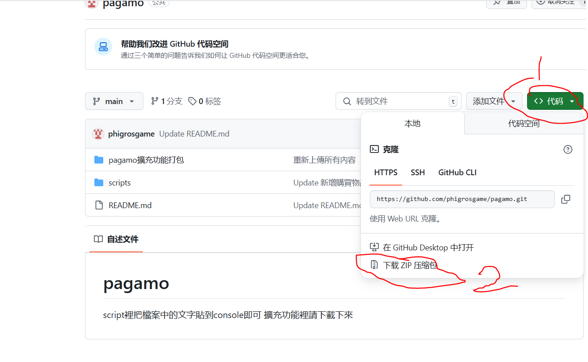

# pagamo
script裡把檔案中的文字貼到console即可 
擴充功能裡請先把整個檔案下載下來，請先點1圈起來的地方 
(如果你沒有翻譯這裡應該是一個綠色的框裡頭寫著`<>code` 
再點2(裡頭寫著`Download ZIP`)之後就會開始下載 
 
下載完成後把下載下來的檔案(應該會叫做`pagamo-main.zip`)解壓縮， 
之後你會在你解壓縮的地方看到一個叫`pagamo-main`的資料夾，點進去兩次(`pagamo-main`裡有個一樣名稱的資料夾) 
之後你會看到`pagamo擴充功能打包`的資料夾，看到了這個資料夾以後， 
🚀 開啟 Chrome 擴充功能頁面：`chrome://extensions/`（請手動複製貼上到網址列）並點擊"載入未封裝項目"並選取`pagamo擴充功能打包`就完成了 

